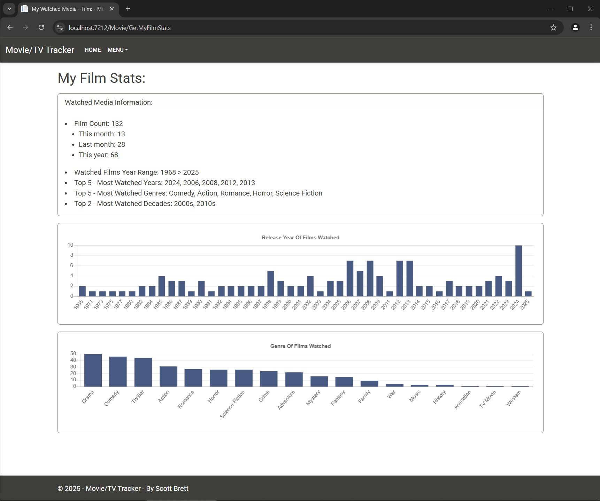
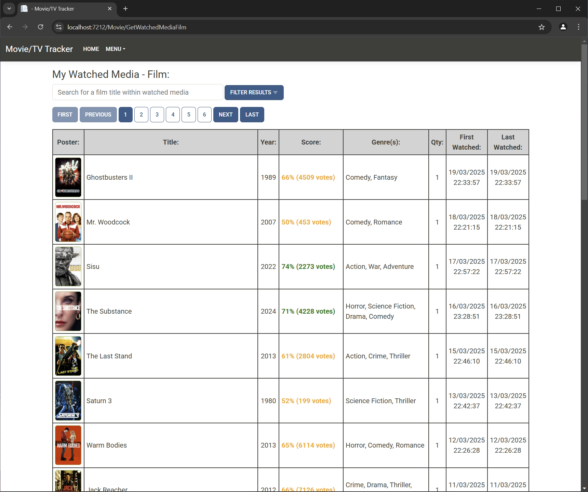
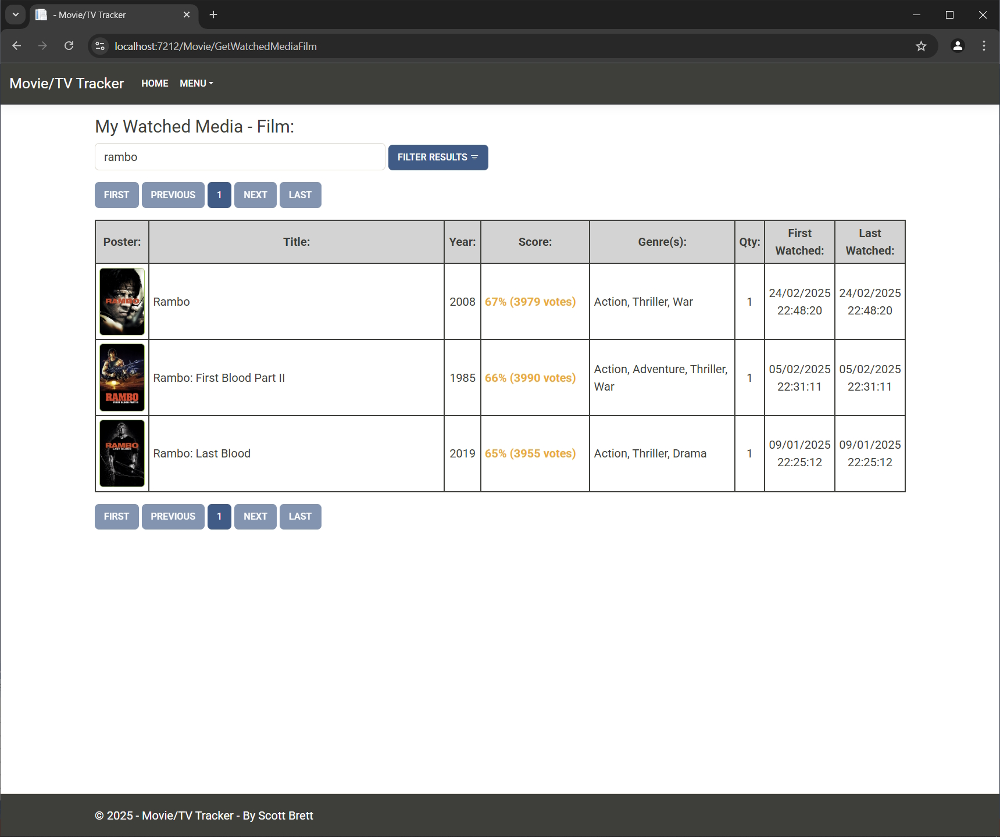

-----------------------------------------------------------------------------
Movie/TV Tracker - About:
-----------------------------------------------------------------------------

First created on: 09/09/2024

I am a avid film fan so when my nephew introduced me to the TMDB (The Movie Database - RESTful API) on one of his demo projects i was keen to give it a go myself and try it out.

1.

In order to utilise the TMDB API effectively across multiple project types i decided to make a C# wrapper (Class library project) for it.  This project includes some basic unit tests for the API as well as a console based test harness for testing out commands.

Project URL: https://github.com/NostalgicCoder/TmdbApi.Lib

2.

The second part of this project (This Codebase) is a full-stack web application built around ASP.NET MVC Core with a SQL Server database backend.  The application utilises the C# wrapped version of the TMDB RESTful API to perform the below capabilities:

- Movie, TV, actor search.
- Display of movies currently showing in UK cinemas.
- Display of detailed movie information.
- Display of detailed TV show information.
- Display of detailed actor information.
- Ability to mark movie/TV shows the user has watched and have them listed under a dedicated page for reference.
- Ability to mark or delete favourite actors and have them displayed under a dedicated page for reference.
- Display of data in a numeric or graph form on the users film/TV habits giving information such as most popular years, genres, decades as well as quantity of movies/TV watched.
- Highlights movie/TV runtime, TMDB score/popularity in different colours to indicate there value (low, medium or high).
- Filter by English or worldwide search results.

Technologies / Principles Used:

- C#
- .NET 8.0
- .NET Core
- ASP.NET MVC Core
- JavaScript
- JQuery
- CSS / Bootstrap themes & icons
- RESTful API
- TMDB API (The Movie Database)
- RestSharp
- Newtonsoft.Json
- Entity Framework - Code first approach
- SQL Server Express
- TDD (Microsoft Test Framework, Fluent Assertions, Fluent Validation)
- Dependency Injection

Requirements:

- SQL Server Express database to be installed
- Developer license key for TMDB API (The Movie Database)
- TmdbApi.Lib (GitHub Project - Can be found here: https://github.com/NostalgicCoder/TmdbApi.Lib)

Resources / Credits:

- https://www.themoviedb.org/?language=en-GB
- https://developer.themoviedb.org/reference/intro/getting-started
- https://getbootstrap.com/docs/5.3/getting-started/introduction/
- https://icons.getbootstrap.com/
- https://bootswatch.com/sandstone/
- https://www.chartjs.org/docs/latest/
- https://www.w3schools.com/ai/ai_chartjs.asp

Video Demo:

NOTE! - Video length is short due to 10mb limit on videos on GitHub

https://github.com/user-attachments/assets/3e7a49fe-6452-428d-ab64-529a6e0c6b20

Images:

